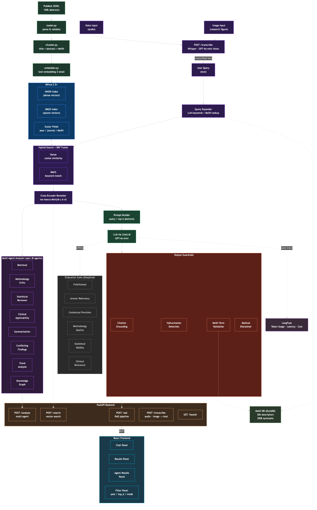
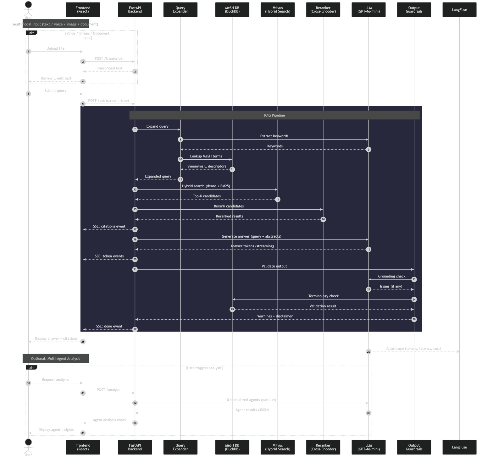

# PubMed RAG — AI-Powered Medical Research Abstract Finder

An AI-powered multimodal medical research retrieval and analysis system that allows clinicians and researchers to explore PubMed publications using natural language queries. The system retrieves relevant medical research abstracts based on semantic similarity, provides structured insights through a multi-agent analysis layer, and includes output guardrails for medical accuracy.

## Architecture

> **Production scaling:** See [docs/production-architecture.md](docs/production-architecture.md) for POC vs Production comparison, Kubernetes deployment, and scaling to 36M+ abstracts.

**System components** — shows services, data stores, and infrastructure:



**Data flow** — shows the request-level sequence through the RAG pipeline:



## Tech Stack

| Component | Technology |
|-----------|-----------|
| Language | Python 3.11+ |
| Package Manager | [uv](https://docs.astral.sh/uv/) |
| Vector Database | Milvus 2.5 (Docker) |
| Embeddings | OpenAI `text-embedding-3-small` (1536-dim) |
| LLM | GPT-4o-mini via LiteLLM |
| Reranker | `cross-encoder/ms-marco-MiniLM-L-6-v2` |
| MeSH Lookup | DuckDB |
| API Framework | FastAPI + Uvicorn |
| Frontend | React 19 + Tailwind CSS 4 + Vite |
| Evaluation | DeepEval |
| Observability | LangFuse (token usage tracking, latency, cost) |
| Containerization | Docker Compose |

## Prerequisites

- Python 3.11+
- Node.js 20+
- Docker & Docker Compose
- [uv](https://docs.astral.sh/uv/) (Python package manager)
- OpenAI API key

## Setup

### 1. Start Infrastructure (Milvus)

```bash
cd capstone

# Set your OpenAI API key
export OPENAI_API_KEY="sk-..."

# Start Milvus and its dependencies
docker compose up -d etcd minio milvus

# Wait for Milvus to be healthy (~90s on first start)
docker compose ps
```

### 2. Install Backend Dependencies

```bash
cd capstone/backend
cp ../.env.example .env   # Edit and set OPENAI_API_KEY
uv sync
```

### 3. Build MeSH Database

Download the MeSH descriptor XML (`desc2025.xml`) from [NLM MeSH Downloads](https://nlm.nih.gov/databases/download/mesh.html), then:

```bash
uv run python scripts/build_mesh_db.py --input data/desc2025.xml --output data/mesh.duckdb
```

### 4. Ingest PubMed Data

```bash
uv run python scripts/ingest_bulk.py \
    ../data_pipeline/data/processed/sampled.jsonl
```

Features:
- Streams JSONL in batches of 100 records
- Progress bar with ETA
- Checkpoint file for resumption on failure
- Automatically creates Milvus collection with dense + BM25 schema

### 5. Start the Backend

```bash
uv run uvicorn src.api.main:app --reload --port 8000
```

Or via Docker:

```bash
cd capstone
docker compose up -d backend
```

API available at `http://localhost:8000`. Health check: `GET /health`.

### 6. Start the Frontend

```bash
cd capstone/frontend
npm install
VITE_API_BASE=http://localhost:8000 npm run dev
```

UI available at `http://localhost:5173`.

### Environment Variables

| Variable | Default | Description |
|----------|---------|-------------|
| `OPENAI_API_KEY` | (required) | OpenAI API key for embeddings and LLM |
| `MILVUS_HOST` | `localhost` | Milvus server host |
| `MILVUS_PORT` | `19530` | Milvus server port |
| `LLM_MODEL` | `gpt-4o-mini` | LLM model for answer generation |
| `EMBEDDING_MODEL` | `text-embedding-3-small` | Embedding model (1536 dim) |
| `SEARCH_MODE` | `dense` | Search mode: `dense` or `hybrid` |
| `RERANKER_TYPE` | `cross_encoder` | Reranker: `none`, `cross_encoder`, or `llm` |
| `MESH_DB_PATH` | `data/mesh.duckdb` | Path to MeSH DuckDB database |
| `LANGFUSE_PUBLIC_KEY` | (optional) | LangFuse public key for observability |
| `LANGFUSE_SECRET_KEY` | (optional) | LangFuse secret key |
| `LANGFUSE_HOST` | `https://cloud.langfuse.com` | LangFuse server URL |

## API Endpoints

| Method | Path | Description |
|--------|------|-------------|
| `GET` | `/health` | Health check |
| `POST` | `/ask` | Full RAG pipeline (supports SSE streaming via `stream: true`) |
| `POST` | `/search` | Semantic/hybrid search with metadata filtering |
| `POST` | `/analyze` | Multi-agent research analysis |
| `POST` | `/review` | Literature review generation (3-stage A2A agent pipeline) |
| `POST` | `/transcribe` | Convert audio/image/document to text (Whisper / GPT-4o-mini / PyMuPDF / python-docx) |

### Example: Ask (RAG Pipeline)

```bash
curl -X POST http://localhost:8000/ask \
  -H "Content-Type: application/json" \
  -d '{
    "query": "What are the latest treatments for early-stage pancreatic cancer?",
    "top_k": 10,
    "search_mode": "hybrid",
    "guardrails_enabled": true
  }'
```

Response:

```json
{
  "answer": "Based on the retrieved research abstracts, several treatment approaches...",
  "citations": [
    {
      "pmid": "38123456",
      "title": "Neoadjuvant FOLFIRINOX in Resectable Pancreatic Cancer...",
      "journal": "Journal of Clinical Oncology",
      "year": 2024,
      "relevance_score": 0.892
    }
  ],
  "query": "What are the latest treatments for early-stage pancreatic cancer?",
  "warnings": [],
  "disclaimer": "Disclaimer: This information is generated from research abstracts...",
  "is_grounded": true
}
```

### Example: Search

```bash
curl -X POST http://localhost:8000/search \
  -H "Content-Type: application/json" \
  -d '{
    "query": "mRNA vaccine efficacy",
    "top_k": 5,
    "year_min": 2022,
    "search_mode": "hybrid"
  }'
```

### Example: Multi-Agent Analysis

```bash
curl -X POST http://localhost:8000/analyze \
  -H "Content-Type: application/json" \
  -d '{
    "query": "mRNA vaccine efficacy",
    "results": [ ... SearchResult objects from /search ... ],
    "agents": ["methodology_critic", "clinical_applicability", "summarization"]
  }'
```

Response:

```json
{
  "query": "mRNA vaccine efficacy",
  "agent_results": [
    {
      "agent_name": "methodology_critic",
      "summary": "3 of 5 studies use randomized controlled trial design...",
      "findings": [
        {"label": "Strong RCT presence", "detail": "3/5 studies are RCTs", "severity": "info"},
        {"label": "Selection bias risk", "detail": "2 observational studies lack matching", "severity": "warning"}
      ],
      "confidence": 0.85,
      "score": 7,
      "details": null
    }
  ]
}
```

### Example: Literature Review Generation

```bash
curl -X POST http://localhost:8000/review \
  -H "Content-Type: application/json" \
  -d '{
    "query": "mRNA vaccine efficacy and safety",
    "top_k": 10,
    "year_min": 2022,
    "search_mode": "hybrid"
  }'
```

Response:

```json
{
  "query": "mRNA vaccine efficacy and safety",
  "overview": "This review examines recent evidence on mRNA vaccine efficacy...",
  "main_findings": "Multiple RCTs demonstrate sustained efficacy of mRNA vaccines...",
  "gaps_and_conflicts": "Conflicting data exist regarding long-term durability...",
  "recommendations": "Further large-scale studies are needed to evaluate...",
  "citations": [
    {
      "pmid": "36789012",
      "title": "Long-term Efficacy of BNT162b2 mRNA Vaccine...",
      "journal": "New England Journal of Medicine",
      "year": 2023,
      "relevance_score": 0.934
    }
  ],
  "search_results": [ ... ],
  "agent_results": [
    {
      "agent_name": "methodology_critic",
      "summary": "4 of 6 studies use randomized controlled trial design...",
      "findings": [...],
      "confidence": 0.88,
      "score": 8
    }
  ],
  "agents_succeeded": 6,
  "agents_failed": 0
}
```

The `/review` endpoint orchestrates a 3-stage pipeline: (1) search retrieval, (2) parallel analysis by 6 specialized agents, and (3) synthesis into a structured literature review. See the [Literature Review Pipeline Design](docs/specs/2026-03-17-literature-review-pipeline-design.md) for architecture details.

### Example: Transcribe (Multimodal Input)

```bash
# Audio file (voice recording)
curl -X POST http://localhost:8000/transcribe \
  -F "file=@recording.mp3"

# Image file (research figure)
curl -X POST http://localhost:8000/transcribe \
  -F "file=@figure.png"

# PDF document (research paper)
curl -X POST http://localhost:8000/transcribe \
  -F "file=@paper.pdf"

# Text file (clinical notes)
curl -X POST http://localhost:8000/transcribe \
  -F "file=@notes.txt"
```

Response:

```json
{
  "text": "What are the survival rates for stage 2 breast cancer treatment?",
  "media_type": "audio"
}
```

For documents (PDF/TXT/DOCX), the extracted text is summarized by LLM into a concise search query:

```json
{
  "text": "FOLFIRINOX neoadjuvant therapy resectable pancreatic cancer survival outcomes",
  "media_type": "document"
}
```

The returned text can then be used as input to `/ask` or `/search`. In the frontend, the transcribed text is automatically populated in the chat input for the user to review and submit.

**Document limits:** 10MB file size, 10,000 character text extraction limit before LLM summarization.

### CLI Usage

```bash
cd capstone/backend

# Basic query
uv run python -m src.cli "What are the latest treatments for breast cancer?"

# With filters
uv run python -m src.cli "knee pain treatment" --year-min 2023 --top-k 5

# Hybrid search + reranker
uv run python -m src.cli "mRNA vaccine efficacy" --search-mode hybrid --reranker cross_encoder

# JSON output
uv run python -m src.cli "pancreatic cancer therapy" --json
```

## Example CLI Output

**Query:** "What are the latest treatments for early-stage pancreatic cancer?"

```
============================================================
Query: What are the latest treatments for early-stage pancreatic cancer?
============================================================

Based on the retrieved research, several treatment approaches are being
investigated for early-stage pancreatic cancer:

1. **Neoadjuvant chemotherapy** — FOLFIRINOX-based regimens have shown
   improved resectability and survival in borderline resectable cases [1][2].

2. **Immunotherapy combinations** — Checkpoint inhibitors combined with
   chemotherapy are under active clinical trials [3].

3. **Stereotactic body radiation therapy (SBRT)** — Used as a bridge to
   surgery, showing promising local control rates [4].

============================================================
Citations (5):
============================================================
  PMID: 34567890 | Neoadjuvant FOLFIRINOX for Pancreatic Cancer
       J Clin Oncol (2023) | Score: 0.892
  PMID: 35678901 | Modified FOLFIRINOX in Borderline Resectable Disease
       Ann Surg Oncol (2023) | Score: 0.856
  ...

Disclaimer: This information is generated from research abstracts and is
intended for educational purposes only. It does not constitute medical
advice. Always consult a qualified healthcare professional for medical
decisions.
```

## Multi-Agent Analysis

The system includes 8 specialized agents that evaluate retrieved research from different expert perspectives:

| Agent | Responsibility | Returns Score |
|-------|---------------|---------------|
| **Retrieval** | Evaluate relevance, coverage, and gaps in search results | No |
| **Methodology Critic** | Evaluate study design, bias risk, methodological rigor | Yes (1-10) |
| **Statistical Reviewer** | Analyze statistical methods, significance, sample sizes | Yes (1-10) |
| **Clinical Applicability** | Assess real-world clinical relevance and applicability | Yes (1-10) |
| **Summarization** | Synthesize insights across all retrieved studies | No |
| **Conflicting Findings** | Identify contradictory results across studies | No |
| **Trend Analysis** | Detect emerging treatments and research trends | No |
| **Knowledge Graph** | Map connections between diseases, treatments, and outcomes | No |

Each agent uses a specialized system prompt + LLM call that returns structured JSON conforming to a common `AgentResult` schema. Agents operate independently (no inter-agent dependencies) and can be selectively invoked via the `agents` parameter in the `/analyze` endpoint.

### Literature Review Pipeline (Agent-to-Agent Handoff)

The `/review` endpoint implements Agent-to-Agent (A2A) communication via a 3-stage in-process pipeline:

1. **Stage 1 — Search:** Retrieves relevant abstracts via `SearchClient`
2. **Stage 2 — Parallel Analysis:** 6 agents run concurrently (`ThreadPoolExecutor`, `max_workers=6`): Methodology Critic, Statistical Reviewer, Clinical Applicability, Conflicting Findings, Trend Analysis, Knowledge Graph
3. **Stage 3 — Synthesis:** `ReviewSynthesizer` merges search results + all agent analyses into a structured `LiteratureReview` with overview, main findings, gaps/conflicts, and recommendations

Each stage's output feeds directly into the next stage as input (in-process function-call handoff). Partial agent failures are handled gracefully — the pipeline continues with degraded results rather than aborting.

The agent logic is also reused as custom DeepEval metrics for evaluating RAG quality (MethodologyQuality, StatisticalValidity, ClinicalRelevance).

## Evaluation

> **Latest results:** See [docs/evaluation-results.md](docs/evaluation-results.md) for the full evaluation report with per-query metrics and latency analysis.

The project uses [DeepEval](https://docs.confident-ai.com/) for RAG quality evaluation with both standard and custom metrics:

```bash
cd capstone/backend
uv pip install -e ".[eval]"
uv run pytest tests/eval/test_rag_evaluation.py -v
```

**Standard Metrics:**
- **Faithfulness** — Is the answer grounded in retrieved context?
- **Answer Relevancy** — Does the answer address the query?
- **Contextual Relevancy** — Are the retrieved contexts relevant to the query?

**Custom Metrics:**
- **Citation Presence** — Are PMID citations included in the response?
- **Medical Disclaimer** — Is a medical disclaimer appended?
- **Methodology Quality** — Study design and methodological rigor (via MethodologyCriticAgent)
- **Statistical Validity** — Statistical methods and significance (via StatisticalReviewerAgent)
- **Clinical Relevance** — Real-world clinical applicability (via ClinicalApplicabilityAgent)

## Running Tests

```bash
cd capstone/backend

# Unit tests (all modules + all agents)
uv run pytest tests/unit/ -v

# Integration tests (requires running Milvus)
uv run pytest tests/integration/ -v

# Evaluation suite (requires running Milvus + ingested data + DeepEval)
uv run pytest tests/eval/ -v
```

## Token Usage Tracking

All LLM calls (query expansion, answer generation, guardrail validation, agent analysis) are automatically traced via LiteLLM's LangFuse integration. When configured, every call logs:

- **Token usage** — prompt tokens, completion tokens, total tokens
- **Latency** — per-call and end-to-end
- **Cost** — estimated cost per model
- **Trace view** — full RAG pipeline trace with parent/child spans

To enable: set `LANGFUSE_PUBLIC_KEY`, `LANGFUSE_SECRET_KEY`, and optionally `LANGFUSE_HOST` in `.env`.

## Design Decisions

| Decision | Choice | Trade-off |
|----------|--------|-----------|
| Vector Database | Milvus 2.5 | Native BM25 + dense hybrid search in a single engine; heavier infra vs. simpler alternatives like ChromaDB |
| Chunking Strategy | One chunk per abstract (title + abstract + MeSH) | Simpler than multi-chunk; sufficient for abstract-length documents (~300 words) |
| Retrieval | Hybrid search (Dense + BM25 via RRF) | Better recall than dense-only; slight latency increase |
| Reranker | Cross-encoder (`ms-marco-MiniLM-L-6-v2`) | Improved precision; adds ~200ms per query |
| LLM Abstraction | LiteLLM | Swap between GPT-4o, Claude, etc. without code changes |
| MeSH Lookup | DuckDB (local) | Fast lookups for 30k+ descriptors; no external service dependency |
| Agent Design | Independent agents + A2A pipeline for literature review | `/analyze`: independent, parallelizable; `/review`: 3-stage A2A handoff via in-process calls |
| Guardrails | LLM-based grounding check + MeSH term validation | Catches hallucinations and unverified medical terms; adds one extra LLM call |
| Streaming | Server-Sent Events (SSE) | Progressive token delivery to frontend; simpler than WebSockets for unidirectional flow |
| Multimodal Input | Whisper (audio) + GPT-4o-mini vision (image) + PyMuPDF/python-docx (documents) | Decoupled `/transcribe` endpoint; no changes to RAG pipeline |
| Deployment | Modular monolith with Protocol-based abstraction | Single deploy for PoC; can split into microservices via env var switch (ADR-0003) |

## Project Structure

```
capstone/
├── docker-compose.yml              # Milvus + etcd + MinIO + Backend + Frontend
├── .env.example                    # Environment variable template
├── docs/
│   ├── architecture.mmd            # Architecture diagram (Mermaid source)
│   ├── architecture.png            # Architecture diagram (rendered)
│   ├── adr/                        # Architecture Decision Records
│   ├── specs/                      # Design specifications
│   └── plans/                      # Implementation plans
├── backend/
│   ├── Dockerfile
│   ├── pyproject.toml
│   ├── src/
│   │   ├── agents/                 # 8 analysis agents + registry + ReviewSynthesizer + ReviewPipeline
│   │   ├── api/                    # FastAPI routes (/ask, /search, /analyze, /review, /transcribe, /health)
│   │   ├── guardrails/             # Input validation & output grounding checks
│   │   ├── ingestion/              # Data loading, chunking, embedding, Milvus setup
│   │   ├── retrieval/              # Hybrid search, query expansion, reranking
│   │   ├── rag/                    # RAG chain orchestration & prompt templates
│   │   ├── shared/                 # Config, models, LLM client, MeSH DB
│   │   └── cli.py                  # CLI entry point
│   ├── scripts/
│   │   ├── ingest_bulk.py          # Bulk ingestion (100k records, checkpointed)
│   │   ├── build_mesh_db.py        # MeSH XML → DuckDB builder
│   │   └── smoke_test.py           # Quick API smoke test
│   └── tests/
│       ├── unit/                   # Unit tests for all modules + agents
│       ├── integration/            # Milvus connection tests
│       └── eval/                   # DeepEval evaluation suite
├── frontend/
│   ├── package.json
│   └── src/
│       ├── App.tsx                 # Main app with Ask/Search/Analyze modes
│       ├── components/
│       │   ├── ChatPanel.tsx       # Chat interface with SSE streaming + file upload
│       │   ├── FilterPanel.tsx     # Search mode, year, top_k filters
│       │   ├── ResultsPanel.tsx    # Citations & search results display
│       │   ├── AgentResultsPanel.tsx # Agent analysis cards with score badges
│       │   ├── ReviewPanel.tsx     # Literature review display with collapsible agent details
│       │   └── MessageBubble.tsx   # Chat message rendering (markdown-ready)
│       ├── lib/api.ts              # API client (REST + SSE streaming)
│       └── types/index.ts          # TypeScript type definitions
├── data_pipeline/                  # PubMed data download & sampling scripts
└── loadtest/                       # Locust load testing
```

## Dataset

**PubMed / MEDLINE Research Abstracts** — 100k sampled records from the full PubMed corpus.

- Source: [HuggingFace ncbi/pubmed](https://huggingface.co/datasets/ncbi/pubmed)
- Key fields: PMID, title, abstract, authors, publication_date, MeSH_terms, keywords, journal
- Format: JSONL (pre-processed from XML)

## License

This project was developed as a capstone project for the FDE Training Program.
